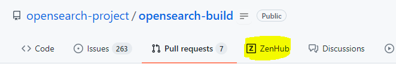

- [Maintainers](#maintainers)
- [ZenHub Process Workflow](#zenhub-process-workflow)
  - [What is ZenHub](#what-is-zenhubhttpswwwzenhubcom)
  - [Dev Deployment](#dev-deployment)
  - [Setting up ZenHub](#setting-up-zenhub)
  - [Sprint Board](#sprint-board)
    - [Pipelines](#pipelines)
  - [Creating Issues](#creating-issues)
  - [Managing issues/stories](#managing-issuesstories)
  - [Spillovers](#spillovers)
  - [Epics](#epics)
  - [Recurring Team Meetings](#recurring-team-meetings)
  - [On-Call](#on-call)

## Maintainers

| Maintainer | GitHub ID | Affiliation |
| --------------- | --------- | ----------- |
| Peter Zhu | [peterzhuamazon](https://github.com/peterzhuamazon) | Amazon |
| Peter Nied | [peternied](https://github.com/peternied) | Amazon |
| Barani Bikshandi | [bbarani](https://github.com/bbarani) | Amazon |
| Sayali Gaikawad | [gaiksaya](https://github.com/gaiksaya) | Amazon |
| Abhinav Gupta | [abhinavGupta16](https://github.com/abhinavGupta16) | Amazon |
| Zelin Hao | [zelinh](https://github.com/zelinh) | Amazon |
| Yilin Zhang | [zylzulu](https://github.com/zylzulu) | Amazon |

[This document](https://github.com/opensearch-project/.github/blob/main/MAINTAINERS.md) explains what maintainers do in this repo, and how they should be doing it. If you're interested in contributing, see [CONTRIBUTING](CONTRIBUTING.md).

## ZenHub Process Workflow
We follow agile methodologies for our development and release process. We use GitHub issues with annotations via ZenHub to manage and track our stories and issues to effectively manage them over the sprint.

### What is [ZenHub](https://www.zenhub.com/)?

ZenHub is an agile project management and product roadmaps solution, natively integrated into GitHub. It is free to use for opensource repository and comes with a paid membership to manage private repositories. 
We currently use ZenHub only with our public and opensource repositories.

### Setting up ZenHub

ZenHub can be easily added as an [extension]((https://www.zenhub.com/extension)) to chrome and firefox which can be downloaded for free from the ZenHub website. 
Alternatively, we can use a the ZenHub [webapp link](https://app.zenhub.com/workspaces/engineering-effectiveness-614cf4272a385f0015d2b48f/board?repos=357723952,406037663) to view the board.

### Sprint Board
Once the ZenHub extension is installed, ZenHub board can be accessed using the ZenHub tab on GitHub.

If you are using the webapp - here is the [link](https://app.zenhub.com/workspaces/engineering-effectiveness-614cf4272a385f0015d2b48f/board?repos=357723952,406037663)

#### Pipelines

1. **New Issues -** Issues to be reviewed and estimated before being added to the Product Backlog.
2. **Icebox -** Low priority Issues that do not need to be addressed in the near future**.**
3. **Product Backlog -** Upcoming Issues that have been reviewed, estimated, and prioritized top-to-bottom.
4. **Sprint Backlog -** Issues ready to be worked on in the sprint, prioritized top-to-bottom.
5. **In Progress -** Issues currently being worked on by the team.
6. **Review/QA -** Issues open to the team for review and testing. Code complete, pending feedback.
7. **Done -** Issues tested and ready to be deployed to production. Verify the acceptance criteria and close the issue.
8. **Closed -** Issues that are deployed to production and closed

Description for each pipeline can also be found on the sprint board by clicking on the 3 dots next to the pipleine name.

### Creating Issues

Follow the steps below to create issues on ZenHub workflow -

1. Create the issue for the desired repository following the required guidelines for mandatory and optional fields on GitHub.
2. Add an acceptance criteria for the issue
3. Add relevant tags to the issue. This would help us to track and filter issues.
4. Select the correct pipeline for the issue (defaults to New Issues )
5. Mark the issue for a sprint (if known)

### Managing issues/stories

1. Everyone working on a task should ensure the following -
    1. Have an issue associated with it to record the work
    2. The issue should be assigned
    3. The issue should have an estimate set
    4. The issue should have the correct pipeline
2. Pull requests raised should be assigned and linked to their issues. There should not be a PR without an issue.
3. If you are working on an issue that belongs to a private repository, create an issue in the opensearch-build repository with only public details to track your work.

#### Spillovers

Spillover issues that were a part of the sprint but were not completed are a good indicator for improvement areas.

These issues will automatically be moved to the next sprint. There are 3 possible cases in this scenario :

1. **Issue is still in sprint backlog -** This is an indication that we need to look again at our sprint planning to help plan better for the sprint. 
2. **Issue is in progress -** This means that we need to create smaller issues such that these can be completed in a sprint. 
3. **Issue is in Review -** These issues should be closed at a priority in the upcoming sprint.

### Epics

An epic is *a large body of work that can be broken down into a number of smaller stories*, or sometimes called “[META] Issues”. Epics often encompass multiple teams, on multiple projects, and can even be tracked on multiple boards. Epics are almost always delivered over a set of sprints.

ZenHub provides an elegant way to incorporate epics reducing a lot of manual work compared to meta issues and easy viewing. Click [here](https://help.zenhub.com/support/solutions/articles/43000010341-an-intro-to-zenhub-epics) for more details.

### Recurring Team Meetings

- **Standup -** Daily standups can easily be managed using the sprint board. The moderator should select the filter for the current sprint and change filter for assignees as we move forward with the standup. 
This would ensure that all the tasks the an individual is working on is correctly represented on the sprint board. 

  Everyone should spend approximately 1 minute to discuss the work without interruption, answering questions like - What did I do yesterday? What is the plan for today? What help I might need from others? After everyone turns, we can discuss go-backs if any. The Moderator keeps track of the time.

- **Grooming -** All team members come together to add items to the Product Backlog.  These issues/stories should have been reviewed, estimated, and prioritized top-to-bottom.

- **Planning -** We go over the product backlog to see what all do we need to complete for the current sprint.

- **Retrospective -** This meeting is held at the end of a sprint used to discuss what went well during the previous sprint cycle and what can be improved for the next sprint.

### On-Call
Since on-call is a weekly rotation, we do not create an issue for on-call. However, if on-call requires you to work on a bug, please make sure that we have issue associated with the task for tracking.
