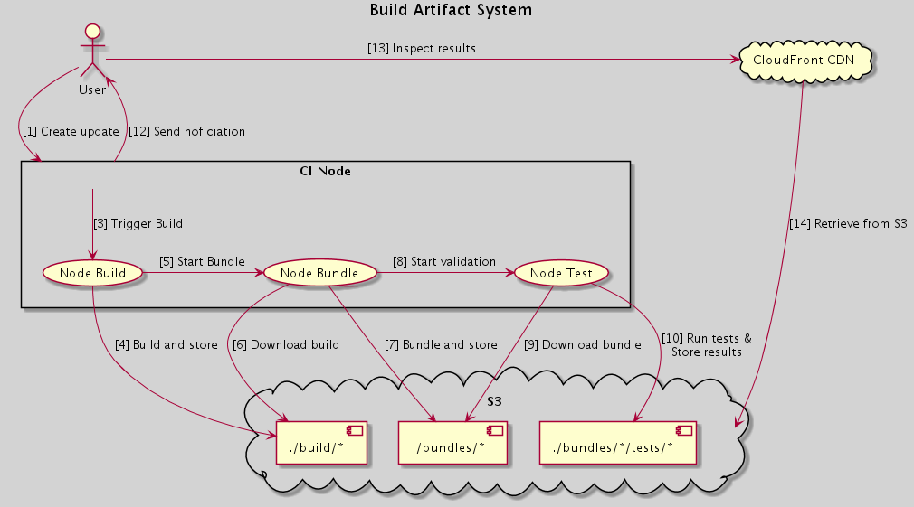
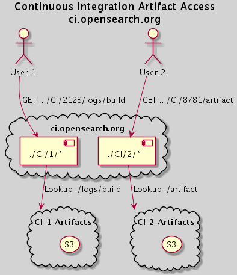

# OpenSearch Build Artifact Stack

- [Build Artifact System](#build-artifact-system)
  - [Overall System](#overall-system)
- [Getting Started](#getting-started)
  - [Useful commands](#useful-commands)
- [Stack Deploy Details](#stack-deploy-details)

Deployment configuration for artifacts associated with the build, bundle, and test validation workflow.

## Build Artifact System

While creating an OpenSearch distribution all of the OpenSearch components are built, then bundled together, and finally tested. The intermediate components should always be available for repeatability and to make sure that a build node death is recoverable.

[Diagram Uml](https://gist.github.com/peternied/439c693273de71216e7ec135dbcb03cd)

### Overall System

Artifacts should all be available via ci.opensearch.org to connect them via a single domain a CI instance specific identifier added to the url and traffic directed from the central CDN.

[Diagram Uml](https://gist.github.com/peternied/e0f9eca659a4af460ae8119adf9e1c69)

## Getting Started

- Requires an IAM Role for the context of the build agent
- Requires [NPM](https://docs.npmjs.com/cli/v7/configuring-npm/install) to be installed
- [Install CDK](https://docs.aws.amazon.com/cdk/latest/guide/cli.html) using `npm install -g aws-cdk`
- Install project dependencies using `npm install` from this project directory
- Configure [aws credentials](https://docs.aws.amazon.com/cdk/latest/guide/getting_started.html#getting_started_prerequisites)
- Deploy with `cdk deploy`

### Useful commands

- `npm run build`   compile typescript to js, run lint, run tests
- `npm run watch`   watch for changes and compile
- `cdk deploy`      deploy this stack to your default AWS account/region
- `cdk diff`        compare deployed stack with current state
- `cdk synth`       emits the synthesized CloudFormation template

## Stack Deploy Details

Standard deployment for fresh accounts can be done with `cdk deploy BuildArtifactDev --parameters buildAgentRoleArn=arn:aws:iam::336984078605:role/JenkinsStackDev-MainNodeInstanceRole6FA3C5C9-1PQFWOWDYN42U`

If the account needs migration from the cloudformation script that was previously used, `cdk deploy ExistingBuildArtifact --parameters buildAgentRoleArn={ROLE_ARN} --parameters buildBucketArn={BUCKET_ARN}`.  During that deployment the existing roles will be updated and there will be manual follow up steps, see the cloudformation output.

- Parameters:
  - _buildAgentPrincipleArn_ [string] The principle arn of the build agent
  - _buildBucketArn_ [string] If there was an existing S3 bucket, the bucket name
