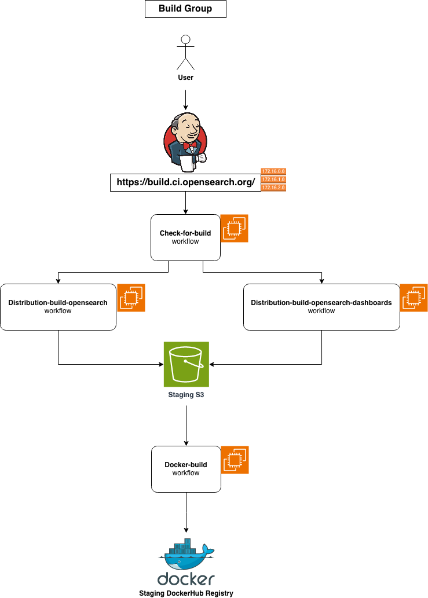
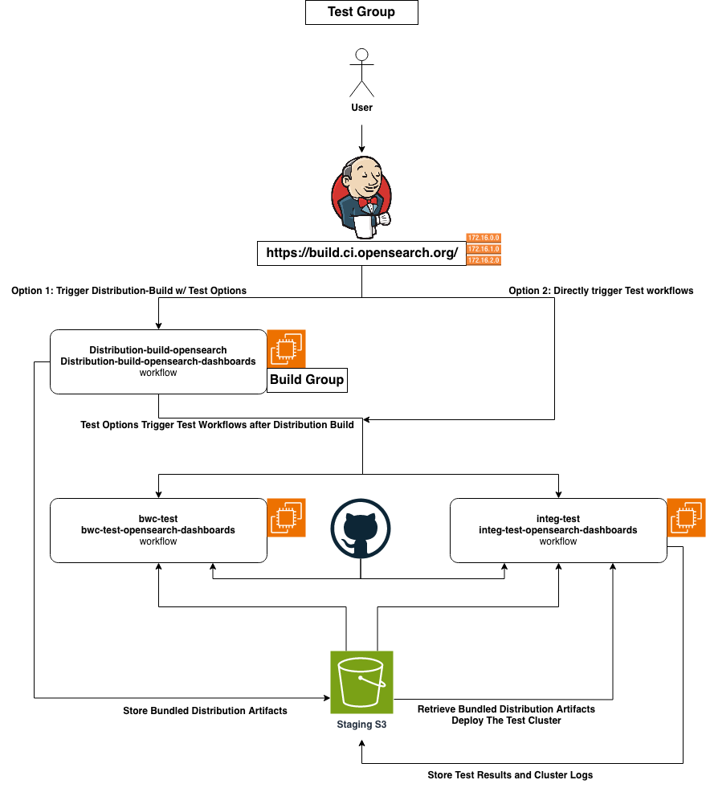
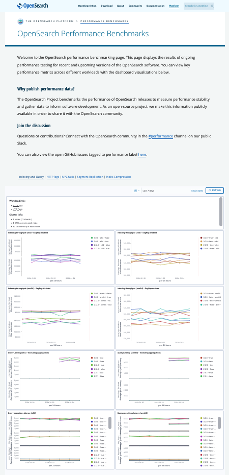
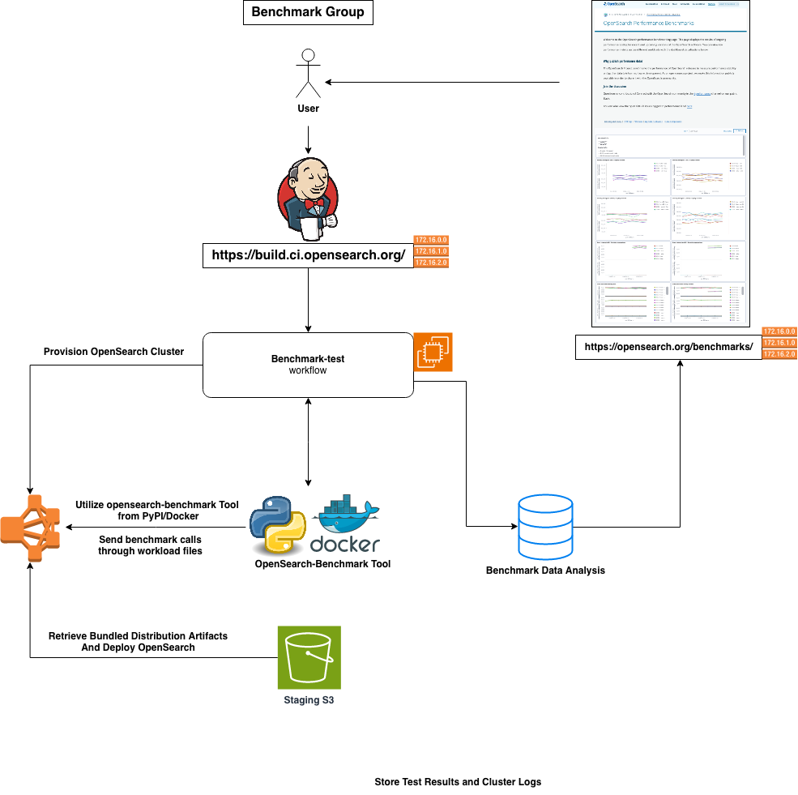
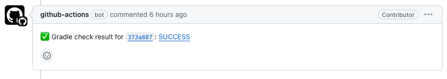
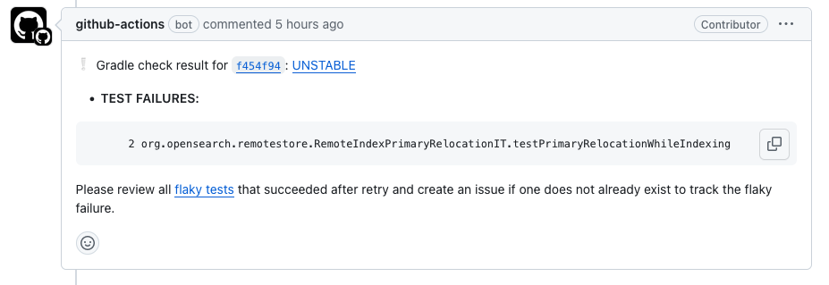
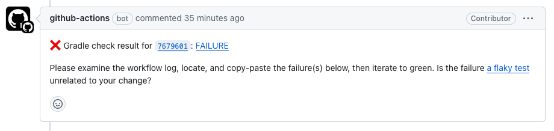
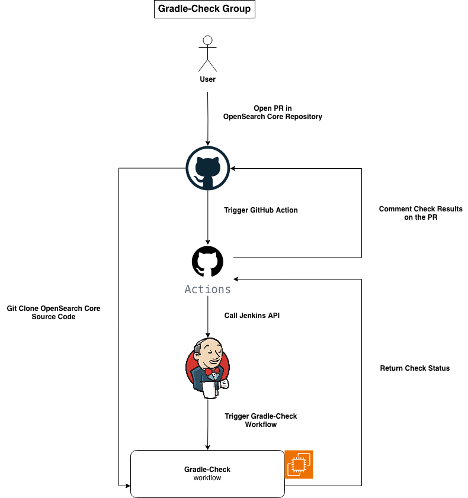
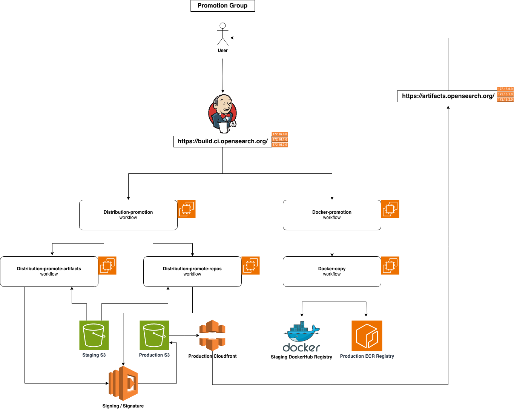

## 1. Build System

The OpenSearch Project has implemented automated build system to manage the complete lifecycle of its public released products and their corresponding artifacts. This build system functions as a continuous integration and continuous deployment (CI/CD) system, initiating the generation of artifacts, and automatically executing tests for each build. Subsequently, automated promotion workflows ensure the shipment of final products to target public distribution channels for users to access, including Docker / ECR, Amazon Simple Storage Service (Amazon S3), Maven, and many more third party services.

The **infrastructure** of the build system is implemented using the AWS Cloud Development Kit (AWS CDK) and is entirely reproducible by the community, with its open-source code available in the [opensearch-ci](https://github.com/opensearch-project/opensearch-ci) repository. It uses a centralized Jenkins Production Cluster as the main automation tool, to drive all the necessary workflows. As of now, it heavily relies on AWS Services to provision necessary resources, including EC2 instances, S3 Buckets, and Secret Manager. However, there are plans to transition it into a more cloud-independent setup for wider adoption in the future.

The **automation scripts** of the build system are developed using Python, Groovy, and Shell. These scripts are responsible for executing actual workflows on the infrastructure created with CDK. The code is open-source and accessible to the public in the [opensearch-build](https://github.com/opensearch-project/opensearch-build) and [opensearch-build-libraries](https://github.com/opensearch-project/opensearch-build-libraries) repositories. Users have the flexibility to utilize the code for replicating workflows on their own infrastructure / server setups, or utilizing our pre-made [Docker CI Images](https://hub.docker.com/r/opensearchstaging/ci-runner/tags?page=1&ordering=last_updated). They can follow the requirements and tutorials outlined in the [README](https://github.com/opensearch-project/opensearch-build/blob/main/README.md) for easy on-boarding process. 

## 2. Release Type

In the OpenSearch Project, there are two types of releases: **Bundled Distribution Release** and **Standalone Component Release**. The former primarily focuses on the OpenSearch and OpenSearch-Dashboards products, bundling the core engine component with all related plugins into a all-in-one type of artifact. The latter involves standalone components such as [opensearch-java](https://github.com/opensearch-project/opensearch-java), [opensearch-js](https://github.com/opensearch-project/opensearch-js), and other related drivers, which can be released independently without any other dependencies.

The **Bundled Distribution Release** primarily relies on the Jenkins cluster in the build system for its various activities / tasks. Several jobs/workflows have been created for this type of release. At a high level, we can categorize these workflows into multiple groups: **build**, **test**, **benchmark**, **gradle-check**, **release**, and others. Each of these groups uses different resources and code for different purposes.

The **Standalone Component Release**, on the other hand, primarily utilizes GitHub Actions. It either directly builds and releases from GitHub Runner or calls a GitHub Webhook to initiate a workflow on Jenkins to accomplish the task.

### **2.1 Bundled Distribution Release**

#### **2.1.1 Build Group**

This group consists of workflows that clone, build, assemble, and store OpenSearch/OpenSearch-Dashboards and its related plugin artifacts in one take.

##### **2.1.1.1 Check-for-build**
The "[check-for-build](https://build.ci.opensearch.org/job/check-for-build/)" workflow is used to periodically check out the latest change in opensearch-project repositories and is usually set to trigger every 60 minutes. It compares the head commit of the given branch in all component repositories with the stored caches on the staging S3 bucket. If any discrepancies are identified, it would then trigger the build/assemble workflows, specifically the "[distribution-build-opensearch](https://build.ci.opensearch.org/job/distribution-build-opensearch/)" and "[distribution-build-opensearch-dashboards](https://build.ci.opensearch.org/job/distribution-build-opensearch-dashboards/)" workflows. 

##### **2.1.1.2 Distribution-build-opensearch / Distribution-build-opensearch-dashboards**
These two workflows start by cloning the repository of each component (including core engine and related plugins), compiling the source code, and storing temporary individual artifacts for future use. After the completion of all builds, the assemble process follows, installing all presented plugin artifacts on top of the core artifact, and archiving the final result into the corresponding final bundled distribution artifact, such as TAR, DEB/RPM, or ZIP. Subsequently, these final artifacts are permanently stored in the staging S3 bucket, allowing later access through CloudFront URLs linked with Route53 DNS.

##### **2.1.1.3 Docker-build and Docker-scan**
As for Docker bundled distribution, an additional workflow named "[docker-build](https://build.ci.opensearch.org/job/docker-build/)" comes into play. This workflow specifically utilizes the TAR distribution bundled artifacts to generate Docker Images. By the last few stages of the "[distribution-build-opensearch](https://build.ci.opensearch.org/job/distribution-build-opensearch/)" and "[distribution-build-opensearch-dashboards](https://build.ci.opensearch.org/job/distribution-build-opensearch-dashboards/)" workflows, the "[docker-build](https://build.ci.opensearch.org/job/docker-build/)" workflow starts by pulling linux base OS images for multiple architectures, extracting the TAR artifacts, copying necessary configuration files, generating multi-arch images with docker buildx toolset, and pushing them to the staging DockerHub registry as release candidates. It will then be followed by "[docker-scan](https://build.ci.opensearch.org/job/docker-scan/)", a workflow to run security scanning for possible vulnerabilities with the Trivy tool. The results of the scan are then reported back in both TXT and JSON format.

|Jenkins Workflow	|Duration	|AWS Resources	|Additonal Resources	|
|---	|---	|---	|---	|
|[check-for-build](https://build.ci.opensearch.org/job/check-for-build/)	|child workflows	|S3 EC2 &nbsp;&nbsp;&nbsp;&nbsp;c54xlarge	|Individual Component Repos (GitHub)	|
|[distribution-build-opensearch](https://build.ci.opensearch.org/job/distribution-build-opensearch/)  [distribution-build-opensearch-dashboards](https://build.ci.opensearch.org/job/distribution-build-opensearch-dashboards/)  [publish-opensearch-min-snapshots](https://build.ci.opensearch.org/job/publish-opensearch-min-snapshots/)	|60min	|S3 EC2 &nbsp;&nbsp;&nbsp;&nbsp;c54xlarge &nbsp;&nbsp;&nbsp;&nbsp;m54xlarge &nbsp;&nbsp;&nbsp;&nbsp;c6g4xlarge &nbsp;&nbsp;&nbsp;&nbsp;mac1metal Cloudfront Lambda Secret Manager	|Individual Component Repos  (GitHub)  Signing Key / Process (AWS Services)	|
|[docker-build](https://build.ci.opensearch.org/job/docker-build/)	|10min-240min depend on runs	|S3 EC2 &nbsp;&nbsp;&nbsp;&nbsp;m52xlarge CloudFront Secret Manager	|[opensearchstaging](https://hub.docker.com/u/opensearchstaging) (DockerHub)	|
|[docker-scan](https://build.ci.opensearch.org/job/docker-scan/)	|5min	|EC2 &nbsp;&nbsp;&nbsp;&nbsp;m52xlarge	|[opensearchstaging](https://hub.docker.com/u/opensearchstaging) (DockerHub)	|

#### **2.1.2 Test Group**

This group consists of workflows that run backward-compatibility test (bwcTest) and integration test (integTest) for the OpenSearch and OpenSearch-Dashboards related plugin artifacts in parallel stages.

##### **2.1.2.1 Backward-compatibility test(s)**
The "[bwc-test](https://build.ci.opensearch.org/job/bwc-test/)" and the "[bwc-test-opensearch-dashboards](https://build.ci.opensearch.org/job/bwc-test-opensearch-dashboards/)" workflows are designed to perform backward-compatibility tests for each new release. We follow SemVar guidelines to make sure that minor / patch releases do not introduce backward incompatible changes. We perform two types of bwctests on our build system, based on the setups and test cases of each individual component repository:

* Rolling Restart Upgrade Test:
    * Cluster with 3 nodes on version 1.x 
    * Upgrade 1 node at a time from 1.x to 2.x 
    * Possibility of nodes having mixed versions in the process of the upgrade test
    * Run test against the cluster 

* Full Restart Upgrade Test: 
    * Cluster with 3 nodes on version 1.x 
    * Upgrade all 3 node simultaneously from 1.x to 2.x 
    * Ensure no mixed versions on the nodes
    * Perform tests against the cluster

##### **2.1.2.2 Integ-test**
The "[integ-test](https://build.ci.opensearch.org/job/integ-test/)" and the "[integ-test-opensearch-dashboards](https://build.ci.opensearch.org/job/integ-test-opensearch-dashboards/)" workflows are designed to execute component / plugin specific integration tests on the build system. For OpenSearch plugins, the "[integ-test](https://build.ci.opensearch.org/job/integ-test/)" workflow initially retrieves the relevant bundled distribution artifacts built with the  "[distribution-build-opensearch](https://build.ci.opensearch.org/job/distribution-build-opensearch/)" and "[distribution-build-opensearch-dashboards](https://build.ci.opensearch.org/job/distribution-build-opensearch-dashboards/)", workflows from the staging S3 bucket. It will then deploy an OpenSearch / OpenSearch-Dashboards cluster with the artifacts on the build system agents with docker container through EC2 instances, serving as the test cluster. Subsequently, it clones all plugin repositories using Git and concurrently executes the `integTest` task defined in the `build.gradle` config file through `Gradle` build tool. The results and logs of the tests are gathered and stored back in the staging S3 bucket for future use.

##### **2.1.2.3 Integ-test-opensearch-dashboards**
For OpenSearch-Dashboards plugins, the "[integ-test-opensearch-dashboards](https://build.ci.opensearch.org/job/integ-test-opensearch-dashboards/)" workflow similarly retrieves the bundled distribution artifacts and uploads test results to the staging S3 bucket. The difference is that OpenSearch-Dashboards integTest clones the "[opensearch-dashboards-functional-test](https://github.com/opensearch-project/opensearch-dashboards-functional-test) (functional-test repo)" repository instead of individual plugin repository. This is due to OpenSearch-Dashboards plugins utilize `Cypress` as the front-end test framework, and the functional-test repo consists of all the plugins' test cases.

##### **2.1.2.4 Trigger Methods**
The distribution-build workflows have options to automatically trigger the above two test workflows, right after the bundled distribution artifacts are built and stored to staging S3 bucket. Alternatively, users have the flexibility to manually trigger the test workflows on demand during the release process.

|Jenkins Workflow	|Duration	|AWS Resources	|Additonal Resources	|
|---	|---	|---	|---	|
| | | |
|[bwc-test](https://build.ci.opensearch.org/job/bwc-test/)  [bwc-test-opensearch-dashboards](https://build.ci.opensearch.org/job/bwc-test-opensearch-dashboards/)	|30-60min	|S3 EC2 &nbsp;&nbsp;&nbsp;&nbsp;c54xlarge &nbsp;&nbsp;&nbsp;&nbsp;m54xlarge &nbsp;&nbsp;&nbsp;&nbsp;c6g4xlarge CloudFront	|Product Core Repositories (GitHub)  Individual Component Repositories (GitHub)	|
|[integ-test](https://build.ci.opensearch.org/job/integ-test/)  [integ-test-opensearch-dashboards](https://build.ci.opensearch.org/job/integ-test-opensearch-dashboards/)	|60-100min	|S3 EC2 &nbsp;&nbsp;&nbsp;&nbsp;c54xlarge &nbsp;&nbsp;&nbsp;&nbsp;m54xlarge &nbsp;&nbsp;&nbsp;&nbsp;c6g4xlarge CloudFront	|Individual Component Repositories  (GitHub)  [opensearch-dashboards-functional-test](https://github.com/opensearch-project/opensearch-dashboards-functional-test) (GitHub)	|

#### **2.1.3 Benchmark Group**

This group consists of the workflow that run Performance Benchmark test for the OpenSearch Core, utilizing [opensearch-benchmark](https://github.com/opensearch-project/opensearch-benchmark) (a macro-benchmarking framework), and its corresponding plugins in the future.

##### **2.1.3.1 Benchmark-test**
The "[benchmark-test](https://build.ci.opensearch.org/job/benchmark-test/)" workflow involves two main actions. Firstly, it clones the [opensearch-cluster-cdk](https://github.com/opensearch-project/opensearch-cluster-cdk) repository and sets up EC2 instances / servers using the provided user parameters. Once this setup is complete, it downloads a tarball artifact with the specified version onto the provisioned EC2 instance and deploys it as a complete OpenSearch cluster.

Once the cluster is up online and in a green state, the workflow utilizes the `opensearch-benchmark` tool on the Jenkins Agent (container). This tool then downloads benchmark workload files and initiates the sending of workloads to the cluster. The tool monitors the cluster's responses to these calls, and collects data on index and query performance/latency.

A comprehensive report is generated and stored for later analysis. Once completed, the data is made available on the [benchmarks page](https://opensearch.org/benchmarks) of the official [opensearch.org](http://opensearch.org/) website for the community to review and check.

|Jenkins Workflow	|Duration	|AWS Resources	|Additonal Resources	|
|---	|---	|---	|---	|
|[benchmark-test](https://build.ci.opensearch.org/job/benchmark-test/)	|30min-120min	|S3 EC2 &nbsp;&nbsp;&nbsp;&nbsp;m52xlarge VPC Cloudwatch	|[opensearch-cluster-cdk](https://github.com/opensearch-project/opensearch-cluster-cdk) (GitHub)  [opensearch-benchmark](https://github.com/opensearch-project/opensearch-benchmark) (GitHub)  [opensearch-benchmark](https://pypi.org/project/opensearch-benchmark/) (PyPI)	|

#### **2.1.4 Gradle-Check Group**

This group consists of the workflow that run Gradle-Check related test cases (heavyweight workflow) for the OpenSearch Core, utilizing [OpenSearch Core](https://github.com/opensearch-project/OpenSearch) repository.

##### **2.1.4.2 Gradle-Check**
The "[gradle-check](https://build.ci.opensearch.org/job/gradle-check/)" workflow is utilized to run a set of unit tests, integration tests, and backward-compatibility tests associated with OpenSearch Core code. Due to the extensive amount of tests it consists, the workflow is quite resource-intensive and demands careful attention to ensure successful execution. Originally set up with GitHub Runner, the workflow was subsequently [migrated to Jenkins](https://github.com/opensearch-project/opensearch-build/issues/851) because the default GitHub runner configurations (2CPU/2GB RAM) could not meet its hardware requirements.

Initiated by a commit in a PR, which then triggers a GitHub Action, the process subsequently utilizes the Jenkins API to invoke the "[gradle-check](https://build.ci.opensearch.org/job/gradle-check/)" workflow along with relevant metadata, including git reference and platform information. The next steps of the process involves provisioning an EC2 instance (M5 8xlarge for Linux, C5 24xlarge for Windows), connecting to the Jenkins main node as an agent, and cloning the OpenSearch Core repository using the specified git reference. A sequence of environment checks and setups is executed, including the verification of Java installations across versions from JDK8 to JDK21, clearing existing Docker containers, and purging the Gradle cache. Following these preparations, the actual tests are initiated with the command `./gradlew check`.

The aforementioned GitHub Action periodically checks the status of the "[gradle-check](https://build.ci.opensearch.org/job/gradle-check/)" workflow via the Jenkins API. Upon completion of the workflow on Jenkins, it provides the final result of the run as a comment on the associated PR so the contributors can act accordingly. The results have three outcomes: **FAILURE**, **UNSTABLE**, **SUCCESS**.

|Jenkins Workflow	|**Duration**	|AWS Resources	|Additonal Resources	|
|---	|---	|---	|---	|
|[gradle-check](https://build.ci.opensearch.org/job/gradle-check/)	|60-80min	|EC2 &nbsp;&nbsp;&nbsp;&nbsp;m58xlarge &nbsp;&nbsp;&nbsp;&nbsp;c524xlarge Secret Manager	|[OpenSearch Core](https://github.com/opensearch-project/OpenSearch) (GitHub)	|

#### **2.1.5 Promotion Group**

This group consists of workflows that responsible for promoting and releasing production-grade artifacts, for OpenSearch and OpenSearch-Dashboards, across various distributions and corresponding release channels.

##### **2.1.5.2 Distribution-Promotion**
The "[central-release-promotion](https://build.ci.opensearch.org/job/central-release-promotion/)" workflow serves as the main trigger for two other workflows: "[distribution-promote-artifacts](https://build.ci.opensearch.org/job/distribution-promote-artifacts/)" for bundled distribution artifacts and "[distribution-promote-repos](https://build.ci.opensearch.org/job/distribution-promote-repos/)" for package repositories.

##### **2.1.5.3 Distribution-promote-artifacts**
The "[distribution-promote-artifacts](https://build.ci.opensearch.org/job/distribution-promote-artifacts/)" workflow is used to publish Linux TAR, Linux DEB, Linux RPM, and Windows ZIP distribution. The workflow first retrieves the corresponding artifacts located on staging S3 bucket, and put to subfolders to organize accordingly. The artifacts will then get signed by creating a PGP detached signature, through AWS Lambda functions. A SHA512 checksum file will also get created for each artifacts, and saved for later use. After all of these actions, all the files will be will then be uploaded to production S3 bucket to be accessed by community through CloudFront URLs.

##### **2.1.5.4 Distribution-promote-repos**
The "[distribution-promote-repos](https://build.ci.opensearch.org/job/distribution-promote-repos/)" workflow is similar to "[distribution-promote-artifacts](https://build.ci.opensearch.org/job/distribution-promote-artifacts/)", with a focus on publishing both the Debian-based APT repository and the RedHat-based YUM repository, using the same Linux DEB and Linux RPM artifacts above. Furthermore, APT repository is generated using `aptly`, while YUM repository is created through `createrepo`. Subsequently, both repositories are uploaded to the same production S3 bucket, allowing for access in a similar manner.

##### **2.1.5.5 Docker-promotion and Docker-copy**
The "[docker-promotion](https://build.ci.opensearch.org/job/docker-promotion/)" workflow is similar to the "[central-release-promotion](https://build.ci.opensearch.org/job/central-release-promotion/)" workflow, serves as the main trigger for multiple "[docker-copy](https://build.ci.opensearch.org/job/docker-copy/)" workflows, in order to promote docker release images from staging registry to production Docker Hub / Amazon ECR registries, for OpenSearch and OpenSearch-Dashboards.

##### **2.1.5.6 Publish-to-maven**
The "[publish-to-maven](https://build.ci.opensearch.org/job/publish-to-maven/)" workflow initiates by fetching all maven artifacts from the staging S3 bucket. Subsequently, an AWS Lambda function is invoked to sign all the .jars and .pom files. Following this, the maven cli is called to publish the artifacts to the sonatype staging repository. A subsequent API call is made to automatically push the artifacts from the sonatype staging repository to the sonatype release repository, before officially synced with the Maven Central repository, ensuring community access.

|Jenkins Workflow	|**Duration**	|AWS Resources	|Additonal Resources	|
|---	|---	|---	|---	|
|[distribution-promote-artifacts](https://build.ci.opensearch.org/job/distribution-promote-artifacts/)  [distribution-promote-repos](https://build.ci.opensearch.org/job/distribution-promote-repos/)  [central-release-promotion](https://build.ci.opensearch.org/job/central-release-promotion/)  [distribution-validation](https://build.ci.opensearch.org/job/distribution-validation/)	|5-15min	|S3 EC2 &nbsp;&nbsp;&nbsp;&nbsp;c54xlarge Cloudfront Lambda Secret Manager Route53 &nbsp;&nbsp;&nbsp;&nbsp;opensearch.org	|Signing Key / Process	|
|[docker-copy](https://build.ci.opensearch.org/job/docker-copy/)  [docker-promotion](https://build.ci.opensearch.org/job/docker-promotion/)	|5-10min	|EC2 &nbsp;&nbsp;&nbsp;&nbsp;m52xlarge Secret Manager ECR &nbsp;&nbsp;&nbsp;&nbsp;opensearchproject/opensearch &nbsp;&nbsp;&nbsp;&nbsp;opensearchproject/opensearch-dashboards	|[opensearchstaging](https://hub.docker.com/u/opensearchstaging) (DockerHub)  [opensearchproject](https://hub.docker.com/u/opensearchproject) (DockerHub)	|
|[publish-to-maven](https://build.ci.opensearch.org/job/publish-to-maven/)	|60min	|S3 EC2 &nbsp;&nbsp;&nbsp;&nbsp;c54xlarge Lambda Secret Manager	|Sonatype / Maven Central  Signing Key / Process	|

### 2.2 Standalone Component Release

As for **Standalone Component Release**, majority of the workflows are using GitHub Actions. You can get more information by reading this blog: https://opensearch.org/blog/standalone-components-release-process/.

## 3. Conclusion

We welcome community feedback and contributions, not only to improve the OpenSearch Project Release Infrastructure but also to reflect on our current achievements. As part of the open-source community, we are actively seeking new perspectives to review and oversee our progress while embracing our commitment to even greater openness. With your assistance, we are confident that the OpenSearch Project will continue to evolve while delivering high-quality products efficiently to the community.
