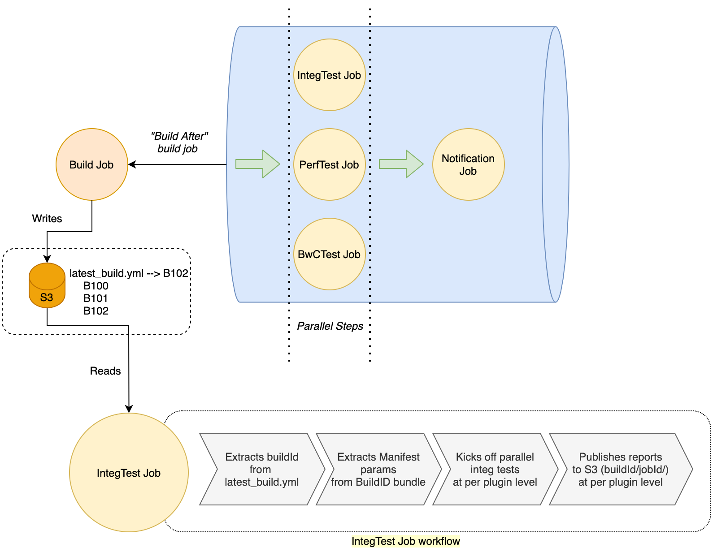

# OpenSearch Release CICD Infrastructure 

*This document is currently work in progress*

# Goal

Automate the release process for all OpenSearch artifacts

# Design

The overall CICD infrastructure is divided into two main workflows - `build` and `test`. The `build` workflow automates the process to generate all kinds of OpenSearch artifacts and provide them as bundles to the `test` workflow. Once the artifacts are built, the `build` workflow kicks off the `test` workflow, which runs exhaustive testing on the artifact based on the artifact type. 

## `build` workflow

Please see the build README [here](https://github.com/opensearch-project/opensearch-build/blob/main/bundle-workflow/README.md) that outlines the tool that will be used from CI.

Jobs within our CI orchestrator (Jenkins) should invoke the build tool linked above and place artifacts into S3.
A nightly job for snapshot builds will execute only the build step above and push artifacts to our maven snapshot repo.
A separate nightly job for release builds should execute the build and bundle steps.  Artifacts from these steps should be linked by the same build ID and pushed to S3.  The build system will then notify the test system (TODO) that there is a new build to pick up and test.  Once tests have been completed the artifacts should be promoted to a /release-candidates folder in S3 and tagged as latest.

## `test` workflow

The `test` workflow consists of  - 

1. test-orchestrator pipeline
2. integTest job
3. bwcTest job
4. perfTest job

*Figure 1 (below) illustrates how different components of the test workflow would interact with each other. Please note, this is a concept diagram, some finer details might change as we build this and the diagram should be changed accordingly.*

**Figure 1** Concept diagram for Automated test infrastructure

### test-orchestrator pipeline

The `test-orchestration-pipeline` is a [Jenkins pipeline](https://www.jenkins.io/doc/book/pipeline/) that orchestrates the `test` workflow after the `build` artifacts are ready. It consists of two stages - test executor and notifications, in the same order. Once the build job has build artifacts ready, it kicks off the pipeline which runs the test executor stage. In test executor stage, the pipeline kicks off `integTest` Job test, `BwCTest` Job and `perfTest` Job in parallel. When all the test jobs complete, the pipeline moves to the notification stage. In this stage, it kicks off a notification job to send out notifications to all configured channels.

The development of `test-orchestration-pipeline` is tracked by meta issue [#122](https://github.com/opensearch-project/opensearch-build/issues/122) 

### integTest job

It is a Jenkins job that runs integration tests on the built artifact. It reads the built artifact composition from the associated manifest file and spins up parallel, independent integrationTest runs for each component built inside the artifact. For instance, if the artifact is a full distribution, which has all opensearch plugins, the job will kick off integration test suite of each individual plugin, in parallel with others. Each plugin integration tests would run against a dedicated single node opensearch cluster, which is based on the built artifact. Once all integration tests complete, it will copy the test results in S3 bucket. 

The development of `integTest` job is tracked by meta issue [#124](https://github.com/opensearch-project/opensearch-build/issues/124)

### bwcTest job 

todo

### perfTest job

todo

## FAQs

1. **How to add a new plugin to testing**
2. **What is the interface between manifest and Integration test job**

