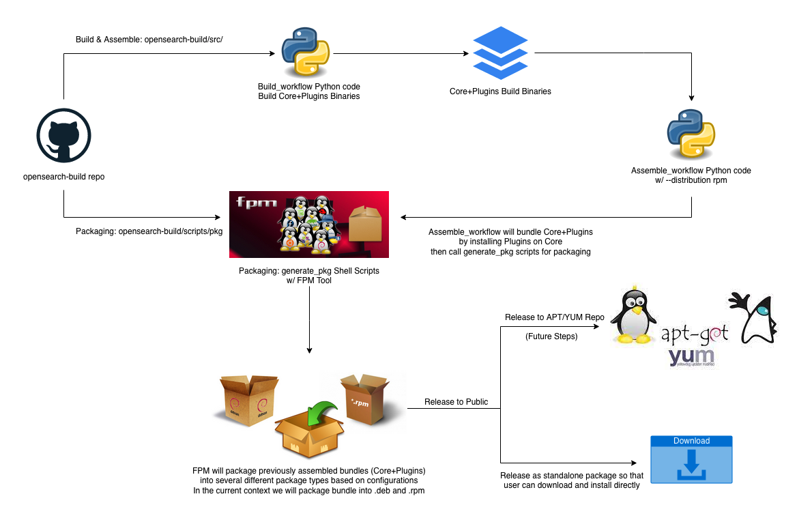

# OpenSearch/Dashboards DEB/RPM Distribution Design Document

---

# RPM/DEB Distribution Support

## Introduction

### Problem Statement

As of 2021/11, [OpenSearch project](_http://opensearch.org/_) only publish **Tarball** and **Docker Images** as part of the release artifacts. As a result, the community is asking for **DEB/RPM** packages from us, as it is an easy approach for LINUX users to deploy, run, and test OpenSearch Clusters alongside OpenSearch-Dashboards, without the complicated manual setups on **Tarball**. After some research, we clearly see the demands from the community and start to investigate the requirements/steps for supporting these new distributions.
Here is the [Meta issue](_https://github.com/opensearch-project/opensearch-build/issues/27_) to track the progress.

---

## Designed Features

1. Both  `.deb` and `.rpm` packages will be provided for users to download and install on their LINUX hosts.
2. The package will include both the **Min** code as well as all the **plugins** for both OpenSearch and Dashboards. (Our design will only support the Distribution DEB/RPM not MIN DEB/RPM).
3. The design contains two parts of changes:
    1. `Assemble_workflow` changes to add `DEB/RPM` distributions as part of the workflow, setup pre-requisite / requirements before a package is generated, and call `Packaging` to generate the package.
    2. `Packaging` changes to include a tool for packaging OpenSearch/Dashboards Distribution/Bundle into a package.
4. `Assemble_workflow` needs to provide `--distribution` as an optional argument for the customer to specify which distribution to build. The argument is exposed to `assemble.sh` . The default value of `--distribution` is “tar”. We should also support “rpm”, “deb” and “zip” as options of distribution. (“deb” will be an option in later updates)

---

## Implementation

### Overview

We are breaking the design into 2 parts, `Assemble Workflow` and `Packaging`. 

* Run existing `build_workflow` to generate Min+Plugins Build Binary for OpenSearch/Dashboards
* Run `assemble_workflow` with our code changes, and passing `--distribution deb/rpm` 
* The `assemble_workflow` will call `packaging` with all the parameters defined in Usage
* `packaging` will call `FPM` with all the parameters and generate packages
* Packages will be copied to `opensearch-build/dist` folder after creation
* The package can now be put into several repositories for customers to consume


### Packaging with FPM

As of 2021/11, there are three tools that we can use to generate deb/rpm packages from Min+plugins build binaries. They are `gradle with ospackage`, `Python Setuptools`, and `FPM`. We choose to use `FPM` as it is still the easiest, most documented, most used tool with the largest package output range support.

### Prerequisites 

Please make sure that the version of `Ruby ~= 2.3.0` and the `FPM` gem is installed. 

### Usage

A long command for `FPM` is called in the assemble workflow including all the details such as service scripts, pre/post scripts, folder structure, architecture, type, and more for fine-grain setup of generating our project `DEB/RPM` packages. 

The inputs of `FPM` are:

```
| name               | description                                                             |
|--------------------|-------------------------------------------------------------------------|
| --force            | Force output even if it will overwrite an existing file.                |
| --verbose          | Enable verbose output.                                                  |
| --input-type       | The package type to use as input.                                       |
| --package          | The package file path to output.                                        |
| --output-type      | Type of distribution to build.                                          |
| --name             | Product name (ex: opensearch/opensearch-dashboards).                    |
| --description      | Add a description for this package.                                     |
| --version          | The version to give to the package.                                     |
| --url              | Add a url for this package..                                            |
| --vendor           | Vendor name for this package which is OpenSearch.                       |
| --maintainer       | The maintainer of this package which is OpenSearch.                     |
| --license          | ASL 2.0.                                                                |
| --before-install   | A script to be run before package installation.                         |
| --before-remove    | A script to be run before package removal.                              |
| --after-install    | A script to be run after package installation.                          |
| --after-remove     | A script to be run after package removal.                               |
| --config-files     | Mark a file in the package as being a config file.                      |
| --template-value   | Make 'key' available in script templates.                               |
| --exclude          | Exclude paths matching pattern (shell wildcard globs valid here).       |
| --architecture     | The architecture name. Can be `x86_64` or `aarch64`.                    |                         |
```

---

## Assemble a RPM/DEB distribution

Currently, we have an [existing assemble workflow]([https://github.com/opensearch-project/opensearch-build#assemble-the-Distribution/Bundle](https://github.com/opensearch-project/opensearch-build#assemble-the-bundle)) implemented with Python. It takes the output from the build step, installs plugins, and assembles a full Distribution/Bundle into a `dist` folder. 

If you have not run the build_workflow yet, here is the command to generate MIN Tarball + Plugin Zips:

```
# OpenSearch
./build.sh manifests/<version>/opensearch-<version>.yml --distribution rpm --platform linux

# OpenSearch-Dashboards
./build.sh manifests/<version>/opensearch-dashboards-<version>.yml --distribution rpm --platform linux

```


Once the build_workflow is completed, you can then run the assemble_workflow. A new argument `--distribution` is introduced to the assemble workflow, so that the distribution can be selected. For now, the input of  `--distribution` can be `rpm` , `tar` or `zip` . The default value is `tar`.

```
# OpenSearch
./assemble.sh builds/opensearch/manifest.yml --distribution rpm --platform linux

# OpenSearch-Dashboards
./assemble.sh builds/opensearch-dashboards/manifest.yml --distribution rpm --platform linux
```

You can then find the generated packages in `dist` folder of `opensearch-build` repo:

```
-rw-rw-r-- 1 opensearch opensearch 2742 Dec 7 23:46 manifest.yml
-rw-rw-r-- 1 opensearch opensearch 447811069 Dec 7 01:01 opensearch-1.2.0-linux-x64.rpm
-rw-rw-r-- 1 opensearch opensearch 213067614 Dec 7 23:46 opensearch-dashboards-1.2.0-linux-x64.rpm

```

---

## Installation and Usages

Once you have the deb/rpm package, you can install and run the OpenSearch cluster on any Debian/RHEL flavored Linux Distro. Besides, `systemd` scripts are provided, so that process manager can directly manage the lifecycle of the cluster.

To install deb/rpm:

```
# Install DEB
sudo dpkg -i opensearch-<version>-linux-x64.deb
sudo dpkg -i opensearch-dashboards-<version>-linux-x64.deb

# Install RPM
sudo rpm -ivh opensearch-<version>-linux-x64.rpm
sudo rpm -ivh opensearch-dashboards-<version>-linux-x64.rpm

```

To start service:

```
#start service
sudo systemctl start opensearch
sudo systemctl start opensearch-dashboards
```

```
#check status
sudo systemctl status opensearch
sudo systemctl status opensearch-dashboards
```

```
#stop service
sudo systemctl stop opensearch
sudo systemctl stop opensearch-dashboards
```

Once the cluster is up, you can then use the API to validate the state, and start to index your data:
https://opensearch.org/docs/latest/opensearch/popular-api/

---

## Frequently Asked Questions

1. What are the prerequisites to deploy OpenSearch Clusters alongside OpenSearch-Dashboards with DEB/RPM?
    1. You need to have a host of LINUX OS from the compatibility list [here](https://quip-amazon.com/L0aUArUbbm9a/OpenSearchDashboards-DEBRPM-Distribution-Design-Document#temp:C:ZfC45cbe3a03a9ea9618def03567).
    2. We will include runtime dependencies such as `JAVA` and `NODEJS` so user does not need to install them manually like in ODFE. 
2. What are the steps to deploy OpenSearch Clusters and OpenSearch-Dashboards with DEB/RPM?
    1. Run these commands:
        1. If you install by using package manager directly (**Future Steps**):
            1. APT: `apt install opensearch`` opensearch_dashboards`
            2. YUM: `yum install opensearch opensearch_dashboards`
        2. If you install by downloading the packages from our website:
            1. DEB: `dpkg -i opensearch-<VERSION>-linux-<ARCH>.deb opensearch-dashboards-<VERSION>-linux-<ARCH>.deb`
            2. RPM: `rpm -ivh opensearch-<VERSION>-linux-<ARCH>.rpm opensearch-dashboards-<VERSION>-linux-<ARCH>.rpm`
3. Do you support other OS that are not mentioned in this README?
    1. No, we will only support the Linux OS for DEB/RPM on the [compatibility list](https://opensearch.org/docs/opensearch/install/compatibility/) of our website.
4. Why are we not using the existing functionalities within `OpenSearch` Min code to generate `DEB/RPM`?
    1. Because those functionalities will only include the Min binary, and lack of all the plugins.
5. What will happen if I do not specify any `--distribution` when running the assemble_workflow
    1. `--distribution` is an optional argument exposed to `assemble.sh` . `argparse` module helped us to define the argument and automatically generates help and usage messages and issues errors when users give the program invalid arguments. The `default` is the keyword we used to specify what value should be used when the `--distributio` is not present. We set `default="tar"`, which means that if `--distributio` is not present, the workflow will assemble tarball.
6. What should I do if I’d like to have the assembled Distribution/Bundle stored in other directory instead of the root folder?
    1. You can change the output directory in the `dist.py` file. For now, we use the `os.getcwd()` to get the current root folder. You can change it to any other directory based on your requirement. The path will be passed into the packaging process.
7. How do I contribute code to the workflow?
    1. We welcome your contribution and recommend you to read the [CONTRIBUTING.md](https://github.com/opensearch-project/opensearch-build/blob/main/CONTRIBUTING.md) as well as the [DEVELOPER_GUIDE.md](https://github.com/opensearch-project/opensearch-build/blob/main/DEVELOPER_GUIDE.md) before getting started. You can also create issues [here](https://github.com/opensearch-project/opensearch-build/issues) if you have any questions and bug reports. Thanks.

