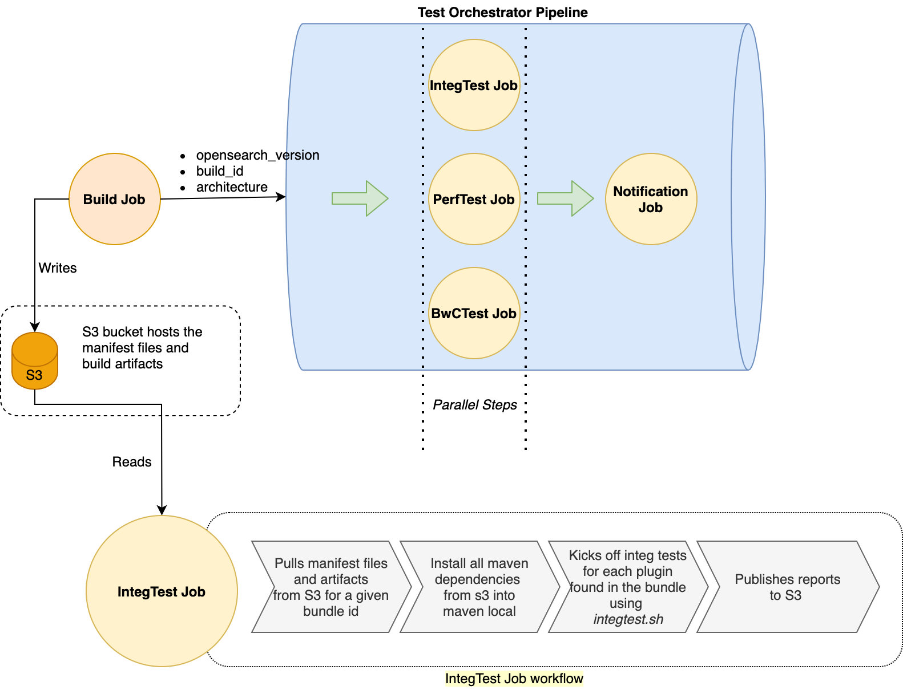

- [Testing a Distribution](#testing-a-distribution)
  - [Test.sh Options](#testsh-options)
  - [Integration Tests](#integration-tests)
  - [Backwards Compatibility Tests](#backwards-compatibility-tests)
  - [Performance Tests](#performance-tests)
- [Testing in CI/CD](#testing-in-cicd)
  - [Test Workflow](#test-workflow)
  - [Component-Level Details](#component-level-details)
    - [test-orchestrator pipeline](#test-orchestrator-pipeline)
    - [integTest job](#integtest-job)
    - [bwcTest job](#bwctest-job)
    - [perfTest job](#perftest-job)
- [Manifest Files](#manifest-files)
- [Dependency Management](#dependency-management)
- [S3 Permission Model](#s3-permission-model)
- [Appendix](#appendix)

## Testing a Distribution

Testing is run via `./test.sh`.

### Test.sh Options

The following options are available.

| name                 | description                                                             |
|----------------------|-------------------------------------------------------------------------|
| test-type            | Run tests of a test suite. [integ-test, bwc-test, perf-test]            |
| test-manifest-path   | Specify a test manifest path.                                           |
| --paths              | Location of manifest(s).                                                |
| --test-run-id        | Unique identifier for a test run.                                       |
| --component          | Test a specific component in a manifest.                                |
| --keep               | Do not delete the temporary working directory on both success or error. |
| -v, --verbose        | Show more verbose output.                                               |

### Integration Tests

Runs integration tests invoking `run_integ_test.py` in each component from distribution manifest.

To run integration tests locally, use below command. This pulls down the built bundle and its manifest file, reads all components of the distribution, and runs integration tests against each component.
 
Usage:

```bash
./test.sh integ-test <test-manifest-path> <target>
```

For example, build locally and run integration tests.

```bash
./build.sh manifests/1.3.0/opensearch-1.3.0.yml
./assemble.sh builds/opensearch/manifest.yml
./test.sh integ-test manifests/1.3.0/opensearch-1.3.0-test.yml . # looks for "./builds/opensearch/manifest.yml" and "./dist/opensearch/manifest.yml"
```

Or run integration tests against an existing build.

```bash
./test.sh integ-test manifests/1.3.0/opensearch-1.3.0-test.yml --paths opensearch=https://ci.opensearch.org/ci/dbc/bundle-build/1.2.0/869/linux/x64 # looks for https://.../builds/opensearch/manifest.yml and https://.../dist/opensearch/manifest.yml
```

To run OpenSearch Dashboards integration tests.

```bash
./test.sh integ-test manifests/1.3.0/opensearch-dashboards-1.3.0-test.yml --paths opensearch=https://ci.opensearch.org/ci/dbc/bundle-build/1.2.0/869/linux/x64
opensearch-dashboards=https://ci.opensearch.org/ci/dbc/bundle-build-dashboards/1.2.0/869/linux/x64 
```

### Backwards Compatibility Tests

Runs backward compatibility invoking `run_bwc_test.py` in each component from a distribution manifest.

Usage:

```bash
./test.sh bwc-test <test-manifest-path> <target>
```

### Performance Tests

TODO

## Testing in CI/CD

The CI/CD infrastructure is divided into two main workflows - `build` and `test`. The `build` workflow automates the process to generate all OpenSearch and OpenSearch Dashboards artifacts, and provide them as distributions to the `test` workflow, which runs exhaustive testing on the artifacts based on the artifact type. The next section talks in detail about the test workflow.

### Test Workflow

Once a new distribution is ready, the `build-job` kicks off the [test-orchestrator-pipeline](../../jenkins_workflow/test/orchestrator/Jenkinsfile) with input parameters `(build_id, architecture, opensearch_version)` that uniquely identify the bundle. The test orchestrator-pipeline generate a unique `test_run_id`, that uniquely identifies the test execution and invokes all three test jobs - `integ-test, bwc-test, perf-test` in parallel.

The [integ-test job](../../jenkins_workflow/test/testsuite/Jenkinsfile) starts by pulling the manifest files and installing the required dependencies for running plugin integration tests. It then kicks off the integration test for each plugin based on the `test-configs` defined in [opensearch-1.3.0-test.yml](manifests/1.3.0/opensearch-1.3.0-test.yml). It executes each configuration separately from others by spinning up a dedicated local test cluster. It uses `integtest.sh` script to run the integration test. There is a [default](../../scripts/default/integtest.sh) version of this script present in opensearch-build repo and also allows plugins to override the default by having a custom integtest.sh in plugin repo.

Once all tests complete, the notifications job can send out the notifications to the subscribed channels. Below figure illustrates how different components of the test workflow would interact with each other. 


**Figure 1**: `test_workflow` components and request flow explained  

### Component-Level Details

#### test-orchestrator pipeline

The `test-orchestration-pipeline` is a [Jenkins pipeline](https://www.jenkins.io/doc/book/pipeline/) that orchestrates the `test` workflow after the `build` artifacts are ready. The orchestrator pipeline consists of two stages - execute and notifications, in the same order. Once the build job has build artifacts ready, it will kick off the pipeline (currently it is manual) which runs the test executor stage. In test executor stage, the pipeline kicks off `integTest` Job test, `BwCTest` Job and `perfTest` Job in parallel. When all the test jobs complete, the pipeline moves to the notification stage. In this stage, it kicks off a notification job to send out notifications to all subscribed channels.

The development of `test-orchestration-pipeline` is tracked by [meta issue #122](https://github.com/opensearch-project/opensearch-build/issues/122) 

#### integTest job

It is a Jenkins job that runs integration tests on a build artifact. It reads the build artifact composition from the associated manifest files and spins up parallel, independent integrationTest runs for each component built inside the artifact. For instance, if the artifact is a full distribution, which has all OpenSearch plugins, the job will kick off integration test suite for each individual plugin. Each plugin integration tests would run against a dedicated single node cluster, which is created from the built artifact. Once all integration tests complete, this job publishes the test results to an S3 bucket. 

The development of `integTest` job is tracked by [meta issue #124](https://github.com/opensearch-project/opensearch-build/issues/124)

#### bwcTest job 

It is a Jenkins job that runs bwc tests on the current version and compatible bwc versions of the artifact. OpenSearch core and each plugin would have their backwards compatibility tests and a `bwctest.sh` which will be used to trigger the bwc tests. Currently, only core and anomaly-detection bwc tests run and the other plugins can be added once they have their bwc tests ready. For example, for anomaly-detection, the job currently runs bwc tests for current version 1.1.0.0 and bwc version 1.13.0.0.

When the bwc test is triggered for a particular component, the tests set up their own cluster and test the required functionalities in the upgrade paths, for the example above, a multi-node cluster starts with bwc versions of OpenSearch and AD installed on it, one or more nodes are upgraded to the current version of OpenSearch and AD installed on it and backwards compatibility is tested. The plugins would add tests for all bwc versions (similar to OpenSearch core) and they can be triggered from the bwcTest job.

The development of the bwc test automation is tracked by meta issue [#90](https://github.com/opensearch-project/opensearch-build/issues/90).

#### perfTest job

It is a Jenkins job that runs performance tests on the bundled artifact using mensor (rally). It reads the bundle-manifest, config files and spins up a remote cluster with the bundled artifact installed on it. It will run performance test with and without security for specified architecture of the opensearch bundle. The job will kick off the single node cdk that sets up a remote cluster. It will then run the performance tests on those cluster using the mensor APIs from the whitelisted account and remote cluster endpoint(accessible to mensor system). These tests are bundle level tests. Any plugin on-boarding does not need to be a separate process. If the plugin is a part of the bundle, it is already onboarded. 

Once the performance tests completes (usually takes 5-8 hours for nyc_taxis track), it will report the test results and publish a human readable report in S3 bucket.

Conversion of Performance Test results to HTML file and JSON file:

The result conversion of the perf-test is as follows-
After the performance test completes, it will report back the test results as well as the test-id. The results here will be in JSON format where they are converted into a tabular HTML string using a template library which is json2html. They will be then written to a HTML file where the file-name’s format is in <test-id>.html. Along with generating a HTML file, a JSON file having the raw JSON data will also be generated whose filename’s format is in <test-id>.json. The reason for creating a JSON file is to give the user the option to view both the JSON data in tabular format in the HTML file and the raw JSON data in the JSON file. The .html as well as .json file generated, will be stored in the path given by the user during the test-suite flow as a command-line args. These will be then taken and published in the S3 bucket.   

The development is tracked by [meta issue #126](https://github.com/opensearch-project/opensearch-build/issues/126)

## Manifest Files

Manifest files are configurations for a particular bundle. `test-workflow` uses three types of manifest files to run test suites. 

1. `test-manifest.yml` provides a list of test configurations to run against a given component in the bundle. An example of a configuration would be, integration test `index-management` plugin `with-security` and `without-security`. This manifest file serves as a support matrix config for the testing and should be updated by plugins if new components or test suites are to be added as part of the release workflow. See [here](manifests/1.3.0/opensearch-1.3.0-test.yml)
2. `build-manifest.yml` created by the build-workflow and provides a list of artifacts built as part of the build-workflow. It assists `test-workflow` pull the maven and build dependencies to run the test suites.
3. `bundle-manfest.yml` created by the build-workflow and provides a list of components packaged in a given bundle.  It assists `test-workflow` to identify what components should be tested for a given bundle.

## Dependency Management 

This section talks about how the `test-workflow` gets the dependencies required by plugins for running integration test suite (and will be extended to backward compatibility in future). There are two types of dependencies - 

1. `maven` - maven artifacts required by plugins
2. `build` - assembled zip artifacts required by plugins, e.g. job-scheduler zip required by index-management plugin.

Plugins depend on a bunch of maven artifacts to successfully run integration tests. Normally the plugin build system pulls these maven artifacts from maven central repository. However, when testing on unreleased candidates, these maven dependencies are not yet available in maven central repo. 

In order to get around this issue, the instrumentation logic in `test-workflow` provides these dependencies into maven local repo, before kicking off the integration test for plugins. The test workflow installs these maven dependencies from the s3 bucket where the build-workflow publishes them during bundle creation phase. Once these dependencies are available in maven local, the plugin build system can use them to run integration tests.

Similarly, some plugins have dependency on other plugins and require their zip artifacts for running integration tests. Example, `index-management` requires `job-scheduler zip` artifacts. These are referred to as build dependencies and are made available by the `test-workflow` to the plugins before the test is started. 

## S3 Permission Model

This section defines how the permissions are configured for reading bundle, tarball, maven dependencies etc. from S3 and writing the results log back to s3 once the tests complete.

The Jenkins infrastructure is setup in an AWS account via cdk. The account provides a `test-orchestrator-role` with permission policy to read and write from s3, see [[1] test-orchestrator-role policy](#appendix) . The `instance-profile` role has `assume-role` permissions on this `test-orchestrator role` which allows the jenkins instance to read and write from required s3 locations.

## Appendix

[1] test-orchestrator-role policy 

```
{
    "Version": "2012-10-17",
    "Statement": [
        {
            "Effect": "Allow",
            "Action": [
                "s3:ListBucket"
            ],
            "Resource": [
                "<S3 bucket arn>"
            ]
        },
        {
            "Effect": "Allow",
            "Action": [
                "s3:GetObject"
            ],
            "Resource": [
                "<S3 bucker arn>/builds/*"
            ]
        },
        {
            "Action": "s3:GetObject",
            "Resource": [
            "<S3 bucket arn>/bundles/*"
            ],
            "Effect": "Allow"
        },
        {
            "Effect": "Allow",
            "Action": "s3:PutObject",
            "Resource": "<S3 bucket arn>/bundles/*/tests/*"
        }
    ]
}
```
